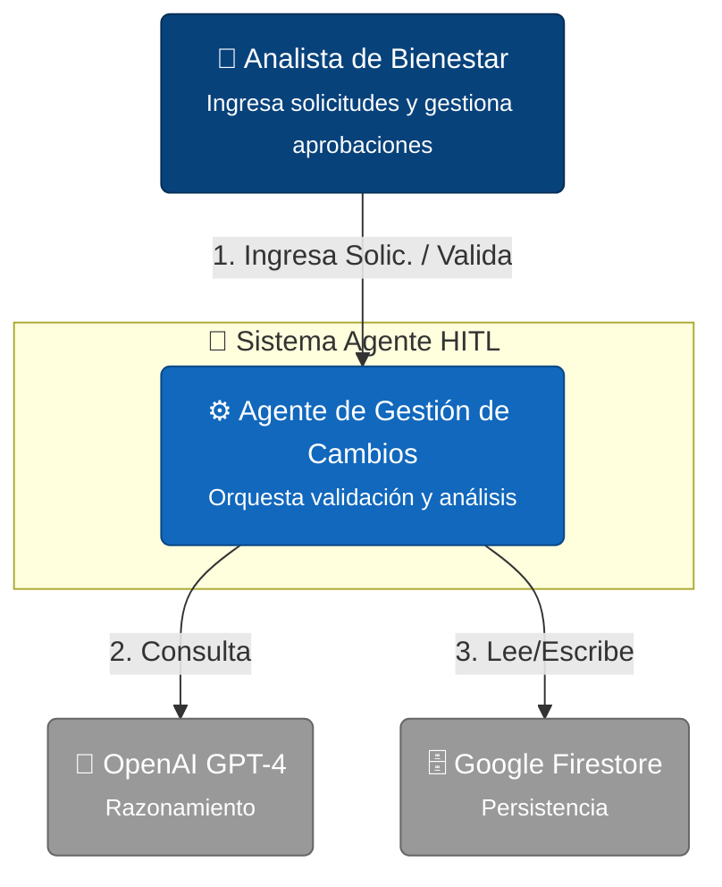
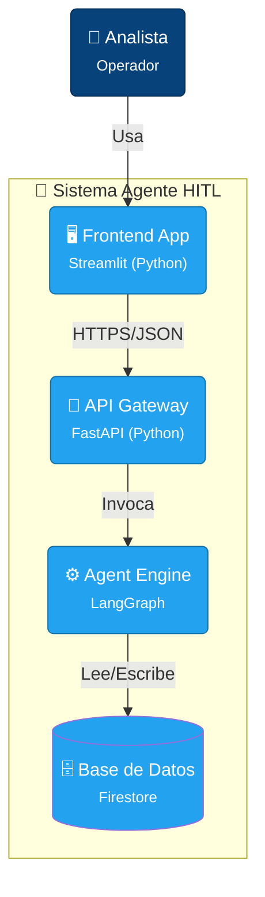
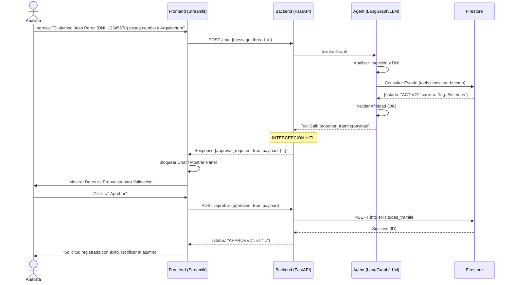
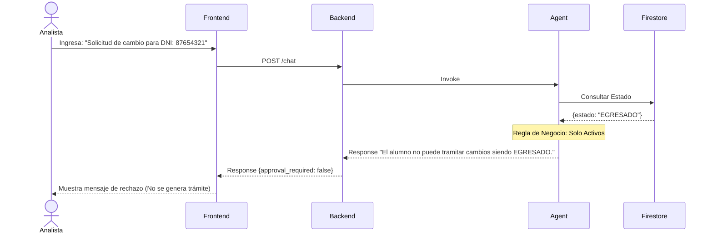

# 🏗️ Arquitectura Técnica del Sistema

**Elaborado por:** Juan Montoro

---

### Nivel 1: Contexto del Sistema
Diagrama de alto nivel que muestra cómo el sistema interactúa con sus usuarios y sistemas externos.

### Nivel 2: Contenedores
Desglose de los componentes desplegables y sus interacciones.

## 2. Detalle de Componentes (Nivel 2)

| Componente | Tecnología | Responsabilidad Principal |
| :--- | :--- | :--- |
| **Frontend App** | Streamlit | Proveer una interfaz unificada. Gestiona el estado de la sesión (`approval_required`) para bloquear el chat cuando se requiere intervención humana. |
| **API Backend** | FastAPI | Punto de entrada. Maneja las rutas `/chat` (interacción) y `/aprobar` (ejecución de escritura). Intercepta la intención de escritura del agente. |
| **Agent Engine** | LangGraph | Core lógico. Define el grafo de estados: `Agent` -> `Tools` -> `Agent`. Decide cuándo llamar a herramientas. |
| **Persistence** | Firestore | Persistencia de datos. Colecciones: `beneficiarios` (lectura) y `solicitudes_tramite` (escritura). |

---

## 3. Flujos de Interacción (Diagramas de Secuencia)

### Escenario A: Interacción Exitosa (HITL Activado)
El analista ingresa una solicitud válida en nombre del becario y luego la aprueba.

### Escenario B: Interacción Fallida (Validación Automática)
El analista ingresa una solicitud de un alumno no apto. El sistema rechaza automáticamente.

---

## 4. Detalles del Agente y HITL

### Herramientas del Agente
El agente tiene acceso estricto a las siguientes herramientas (Tools):

1.  **`consultar_estado_becario(dni: str)`**
    *   **Propósito:** Lectura (Safe).
    *   **Cuándo se usa:** Siempre que se identifica un DNI en la solicitud.
    *   **Retorno:** Objeto JSON con estado, carrera actual, institución, etc.

2.  **`proponer_tramite(solicitud: Schema)`**
    *   **Propósito:** Escritura (Unsafe / Requires Approval).
    *   **Cuándo se usa:** Solo si el estado es `ACTIVO` y el análisis de afinidad es positivo.
    *   **Comportamiento:** No escribe en BD. Retorna un payload estructurado que el Backend intercepta.

### Activación del Human-in-the-Loop (HITL)
El mecanismo HITL no es una "herramienta" que el LLM decida usar para "pedir ayuda", sino una **regla de arquitectura**:
*   El Agente **NUNCA** tiene permiso de escritura directa en la base de datos de solicitudes.
*   Cualquier intento del Agente de ejecutar una acción de "escritura" (`proponer_tramite`) es detectado por el Backend.
*   El Backend detiene el flujo automático y delega la ejecución final a la API de `/aprobar`, que solo es invocada por el humano.

### Guía de Interpretación: Pantalla de Aprobación
Cuando el sistema activa el modo HITL, verás el siguiente panel:

| Sección | Descripción | Qué buscar |
| :--- | :--- | :--- |
| **Datos de la Solicitud (JSON)** | Información cruda que se guardará en BD. | Verifica que el DNI y la Carrera Destino sean correctos. |
| **Análisis del Agente** | Justificación generada por la IA sobre la afinidad. | Lee el razonamiento. ¿Tiene sentido el cambio pedagógicamente? |
| **Botones de Acción** | Controles de decisión. | **Aprobar:** Escribe en BD y notifica al alumno. **Rechazar:** Cancela el flujo y el agente informa al alumno. |
