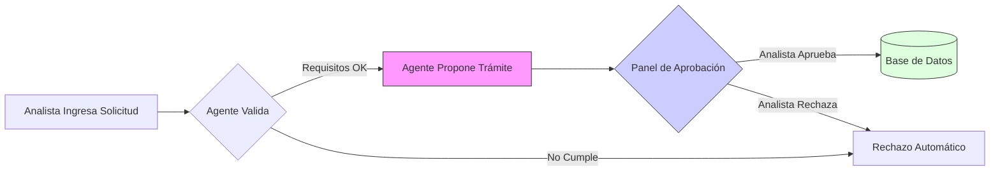
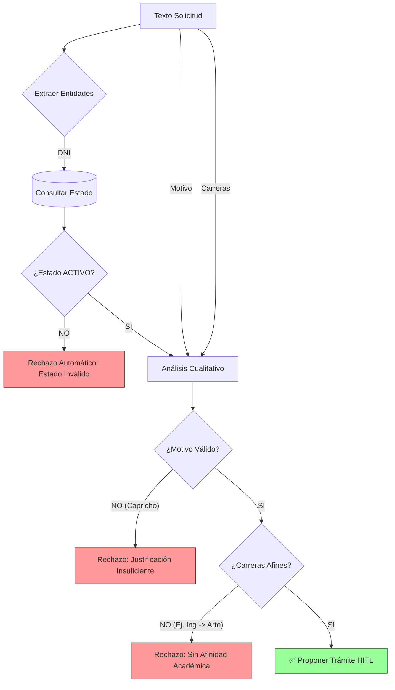

# 📘 Proyecto de Integración: Agente HITL para Gestión de Cambios de Carrera

**Elaborado por:** Juan Montoro  
**Versión:** 1.0  
**Fecha:** Febrero 2026

---

## 1. Definición del Proyecto
Este proyecto implementa un sistema inteligente de gestión de solicitudes de cambio de carrera para una institución educativa. Utiliza un **Agente de IA (Human-in-the-Loop)** que actúa como primer filtro, validando requisitos académicos y analizando la afinidad de la solicitud antes de escalarla a un operador humano para su aprobación final.

## 2. El Problema
El proceso actual de cambio de carrera presenta los siguientes desafíos:
- **Carga Operativa:** El personal administrativo revisa manualmente cientos de solicitudes, muchas de las cuales no cumplen con los requisitos básicos (ej. alumno egresado u observado).
- **Subjetividad:** La evaluación de la "afinidad" entre carreras puede variar según el criterio del analista.
- **Riesgo:** Existe la posibilidad de aprobar cambios no reglamentarios por error humano.

## 3. Propuesta de Solución
Se propone una arquitectura **Agéntica HITL (Human-in-the-Loop)** que:
1.  **Automatiza la Validación:** Un agente inteligente verifica en tiempo real el estado del alumno en la base de datos institucional.
2.  **Asiste la Decisión:** El agente analiza la justificación del alumno y la compatibilidad de carreras, generando un pre-dictamen.
3.  **Control Humano:** Las acciones críticas (registros en base de datos) son interceptadas y requieren aprobación explícita de un operador a través de una interfaz dedicada.



## 4. Lógica de Análisis del Agente (LLM)
El agente no solo valida datos duros (DNI, Estado), sino que evalúa cualitativamente la solicitud.

### Ejemplo de Solicitud (Input del Analista)
> *"El becario Juan Perez (DNI: 12345678) solicita cambio de Ingeniería de Sistemas a Ingeniería de Software. Indica que ha descubierto que su vocación es el desarrollo de backend y que los cursos de su carrera actual se enfocan mucho en hardware, lo cual no se alinea con sus metas profesionales."*

### Criterios de Evaluación
El LLM verifica tres pilares antes de proponer el trámite:
1.  **Estado Académico:** ¿Es alumno 'ACTIVO'? (Consulta a BD)
2.  **Afinidad:** ¿Tienen relación las carreras? (Sistemas <-> Software ✅)
3.  **Justificación:** ¿El motivo es válido?
    *   *Válido:* Vocación, especialización, mercado laboral.
    *   *Inválido:* "Me aburrí", "Mi amigo se cambió", "Es más fácil".

### Diagrama de Razonamiento


## 5. Arquitectura General

### Componentes Principales
*   **Agent Service (Backend):** 
    *   Construido con **FastAPI** y **LangGraph**.
    *   Orquesta el flujo de conversación y razonamiento.
    *   Implementa herramientas de búsqueda y validación.
*   **Firestore Database:**
    *   Repositorio NoSQL para almacenar datos de beneficiarios y solicitudes.
*   **Frontend (Streamlit):**
    *   Interfaz de usuario dual: Chat para el alumno y Panel de Aprobación para el analista.

## 5. Inicialización de Servicios en Local

### Prerrequisitos
- Python 3.9+
- Cuenta de Google/Firebase con credenciales (`firebase_credentials.json`).
- API Key de OpenAI.

### Pasos de Instalación

1.  **Clonar y configurar entorno:**
    ```bash
    git clone <repo-url>
    cd PROYECTO_INTEGRACION
    python -m venv .venv
    .venv\Scripts\Activate
    pip install -r requirements.txt
    ```

2.  **Configurar Variables de Entorno:**
    Crea un archivo `.env` en la raíz con:
    ```env
    OPENAI_API_KEY=sk-...
    FIREBASE_CREDENTIALS_PATH=./firebase_credentials.json
    BACKEND_API_URL=http://localhost:8000/api
    ```

3.  **Cargar Datos Semilla (Opcional):**
    ```bash
    python scripts/seed_firestore.py
    ```

4.  **Iniciar Backend:**
    ```bash
    python src/agent_backend/main.py
    ```
    *Servidor escuchando en `http://localhost:8000`*

5.  **Iniciar Frontend:**
    ```bash
    streamlit run src/frontend/app.py
    ```
    *Interfaz accesible en `http://localhost:8501`*
